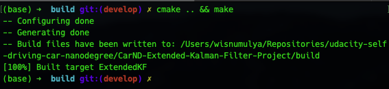
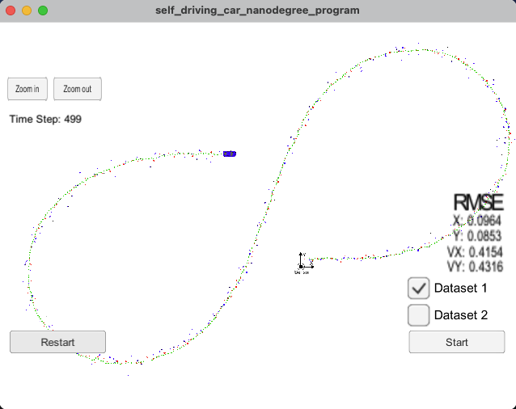
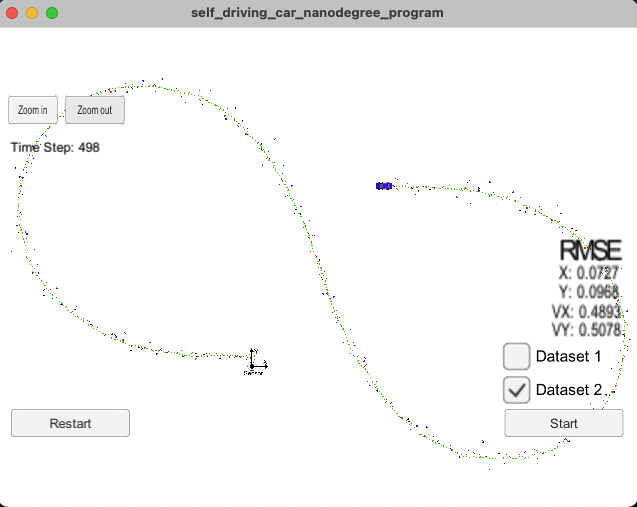
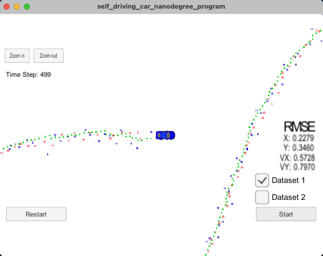
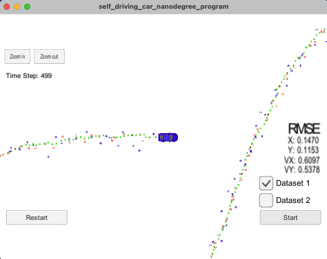

# Extended Kalman Filter Project #
---

## Rubric Points ##
In this writeup, I am adressing the [project rubrics](https://review.udacity.com/#!/rubrics/1962/view)
individually and describing how I approach each points in my implementation.

---

## Compiling ##

### 1. Code should compile ###
The code has been successfully implemented without error, as shown on the image below:

## Accuracy ##

### 1. RMSE <= [.11, .11, .52, .52] ###
The code has managed to keep the RMSE below the rubrics threshold. The images below show
the RMSE resulted from both dataset 1 and dataset 2.

Two particular points have been the keys in my approach to achieve these results:
* Avoiding using C++ `pow()` function turns out to be significant in lowering the RMSE
result: directly multiplying the squareroot and its operand produces lower RMSE, as
seen at `line 55` of `tools.cpp`.
* Using `atan2()` at `line 53` of `kalman_filter.cpp` results in a desirable outcome
of calculating the difference of radar measurement with predicted state, since it results
in a four quadrants space, instead of two, as is the case with `atan()`.

## Correct Algorithm ##

### 1. Sensor Fusion Algorithm ###
The code has emulated the solution approach presented in the lessons. The overview of the
approach I took is the following:
1. Initialize R matrices and H_laser matrix in `FusionEKF` constructor at `line 15` of 
`FusionEKF.cpp`.
2. Handle initial measurement at `line 49` of `FusionEKF.cpp`, as explained below.
3. Apply EKF prediction from `line 87` of `FusionEKF.cpp`, as explained below.
4. Apply EKF update from `line 113` of `FusionEKF.cpp`. Sensor Fusion as a way to handle
multiple inputs is also implemented in this step, as explained below.
5. In update, Jacobian calculation is abstracted under `tools.cpp` at `line 42`.
6. Abstract RMSE calculation under `tools.cpp` at `line 12`.

### 2. Initial Measurement Handling ###
Elements that are initialized in this step are:
* `x_`: differ of whether the first measurement is from radar or lidar, as seen at
`line 69` of `FusionEKF.cpp`.
* `P_`: covariance state with the value of `1` for `px` and `py` covariances and
`1000` for `vx` and `vy` covariances.
* `F_`: transition matrix with the `(0,2)` and `(1, 3)` components to be set as
`dt` in the prediction step at `line 98` of `FusionEKF.cpp`.

### 3. Kalman Filter Algorithm: Predict First, then Update ###
The EKF algorithm first applies prediction and then update, as instructed. 

The prediction step also calculates the elapsed time, as seen at `line 91` of 
`FusionEKF.cpp`, to be integrated in the `F_` matrix and the calculation of the `Q_` matrix.

### 4. Radar & Lidar Measurements ###
The radar and lidar measurements are coded at the update step of the EKF at `line 113` of
`FusionEKF.cpp` and the details of the functions are under `kalman_filter.cpp`.

The update process of both is approximately similar, except for the `ekf_.H_` matrix which 
uses the Jacobian one for radar measurement and also the translation of `x_` into the 
measurement space which uses a function, instead of a linear operation, as seen at `line 46` 
of `kalman_filter.cpp`.

## Code Efficiency ##

### 1. Avoid Unnecessary Calculations ###
Some variables are declared to uphold the DRY principle, as seen at the followings:
* `line 94` to `line 96` of `FusionEKF.cpp`
* `line 47` to `line 54` of `kalman_filter.cpp`
* `line 47` to `line 55` of `tools.cpp`

## Reflections##

### Future Improvements ###
Ideas on future improvements to lower the RMSE or even a more efficient algorithm are as follow:
* Tinker with the initial covariance `P_` declaration for the `vx` and `vy` ones, as suggested
on a [Udacity office hour](https://www.youtube.com/watch?v=J7WK9gEUltM&feature=youtu.be).
* Apply some selective measure in sensor fusion or EKF's update step: combine or skip some
measurements under certain conditions.
* Dive deeper into C++ lessons to explore some refactoring techniques.

### Analysis on Radar or Lidar Only Update ###
Trials of using both radar or lidar only result in RMSE values which are greater than when
both are used with a Sensor Fusion approach. This makes sense, since multiple measurements
from different sensors would produce a more accurate and confident post probability distribution
in Bayesian sense.

Images of both trials are shown below:

